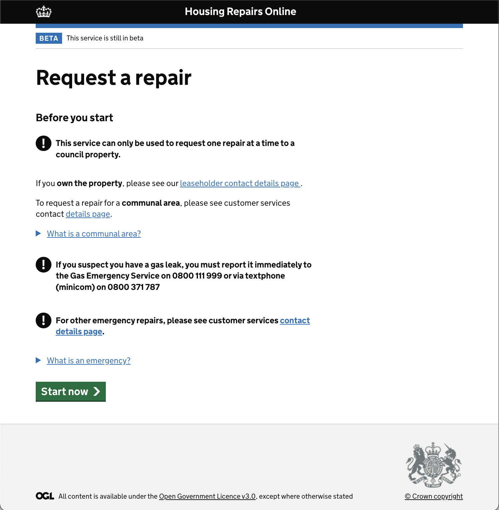
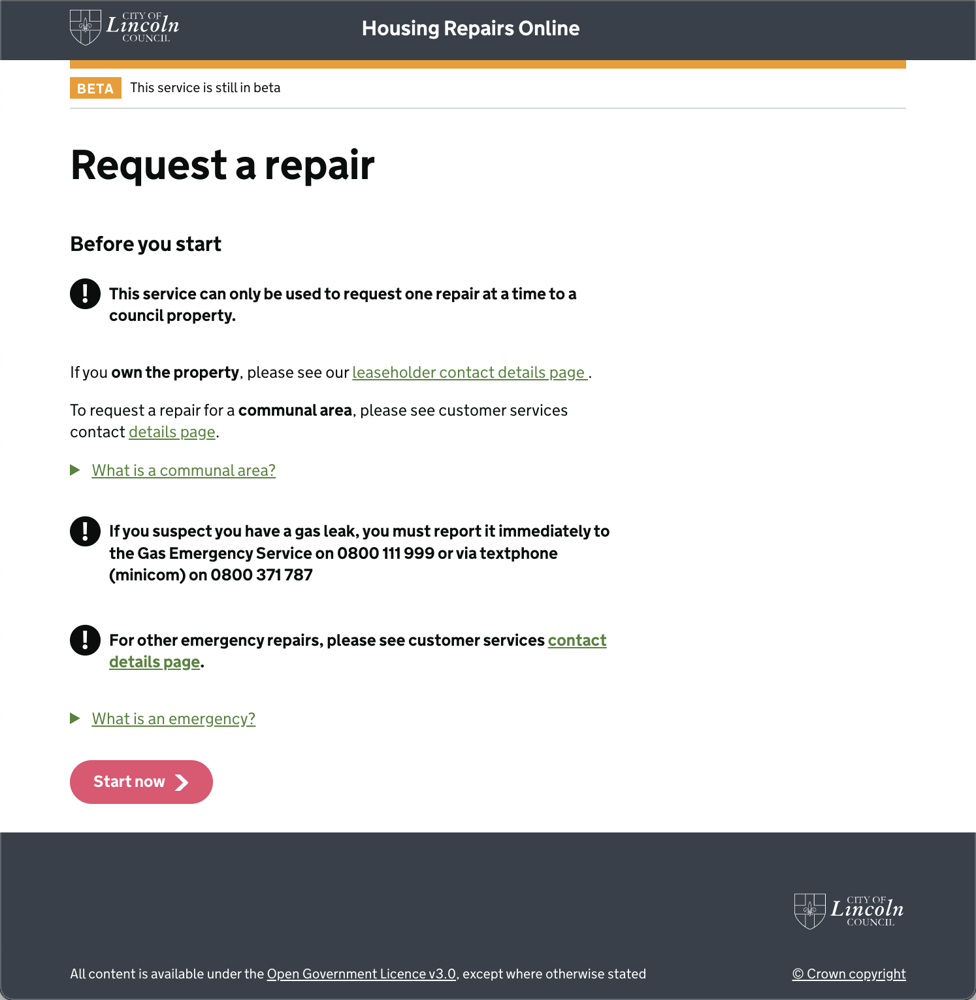

# Housing Repairs Online

This is a [Next.js](https://nextjs.org/) project bootstrapped with [`create-next-app`](https://github.com/vercel/next.js/tree/canary/packages/create-next-app).

# Copilot

Services running in each environment run in separate AWS accounts,However all services are deployed by pipelines from the build and deploy account.

DONT run `copilot svc deploy` or any other copilot command from any other account than `rnd-bnd`. 

Before running any copilot commands run this

1. Define AWS profile env var `export AWS_PROFILE=rnd-bnd`
2. Authenticate with AWS `aws sso login`

## Getting Started

Install all dependencies:

```bash
yarn install
```

Copy the `example.sentryclirc` file and set the token to from your sentry account:

```bash
cp example.sentryclirc .sentryclirc
```
Globally install azure function tools:

```bash
 npm install -g azure-functions-core-tools@3 --unsafe-perm true
 ```
In one terminal run the next development server:

```bash
nvm use && yarn dev
```
In another terminal run the function server:

Copy the `example.env` file and set the values to point to the repairs API:

```bash
cd api/ && cp example.env .env
```

Start the development function

```bash
cd api/ && nvm use && yarn start
```
> if the function doesn't start try switching your node version to 14.0.0 

Open [http://localhost:3000](http://localhost:3000) with your browser to see the result.

## Look and feel
The app can be deployed using original 
[Gov.uk design system](https://design-system.service.gov.uk/get-started/)
styles or using Lincoln.gov styles.

| Original | Lincoln |
| ---- | ---- |
|  |  |

To return to the original design, remove `@import "lincoln";` from
[`globals.scss`](https://github.com/City-of-Lincoln-Council/housing-repairs-online-frontend/blob/f088657699c0b9617a8929329fe77004b98eaa72/styles/globals.scss#L3)

To find out how these interface was designed, please read the [common service pattern](https://github.com/City-of-Lincoln-Council/housing-repairs-online-frontend/blob/main/Common%20service%20patern.pdf).

## Learn More

To learn more about Next.js, take a look at the following resources:

- [Next.js Documentation](https://nextjs.org/docs) - learn about Next.js features and API.
- [Learn Next.js](https://nextjs.org/learn) - an interactive Next.js tutorial.

You can check out [the Next.js GitHub repository](https://github.com/vercel/next.js/) - your feedback and contributions are welcome!

# General note dump

- Testing:
  - [Jest](https://jestjs.io/docs/getting-started) is used for unit testing `yarn test`
  - [Cypress](https://docs.cypress.io/) is used for integration testing `yarn test:integration`
- Local dev
  https://github.com/Azure/static-web-apps-cli
